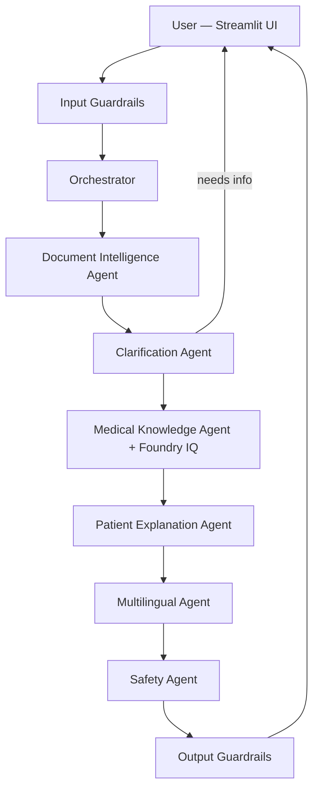

# MedBridge AI 🏥

> **"Don't just translate my medical report. Help me understand what's happening to me."**

Multilingual medical reasoning platform — six Foundry agents, clarification loop, Foundry IQ grounding, and layered safety guardrails.


**Live demo:** [medbridge-ai.streamlit.app](https://medbridge-ai.streamlit.app) · **Repo:** [github.com/Tanvishah15/medbridge-ai](https://github.com/Tanvishah15/medbridge-ai)

---

## Problem

Patients receive lab reports, imaging results, and discharge summaries they **cannot understand** — often in medical English while they speak Hindi, Spanish, or Arabic at home. Generic translators miss clinical context, skip symptom-to-report matching, and can sound like a doctor diagnosing or prescribing. Families need **grounded, safe, plain-language explanations** — not a wall of jargon.

## Solution

**MedBridge AI** is a multi-agent reasoning system on **Microsoft Foundry** that:

1. **Structures** uploaded synthetic reports (ENT, blood, MRI)
2. **Asks clarifying questions** when symptoms are incomplete (1–3 questions, max 2 rounds)
3. **Retrieves grounded facts** from **Foundry IQ** with citations
4. **Explains** in simple language matched to literacy and audience (patient vs family)
5. **Translates** to Hindi, Spanish, or Arabic with culturally appropriate tone
6. **Validates safety** — no diagnosis, prescription, or treatment-change advice

---

## Hackathon submission

| Field | Value |
|-------|--------|
| **Event** | Agents League Hackathon 2026 |
| **Track** | Reasoning Agents (Microsoft Foundry) |
| **IQ integration** | Foundry IQ — Azure AI Search knowledge base with citations |
| **Framework** | Microsoft Agent Framework (Python) |
| **UI** | Streamlit (live on Streamlit Cloud) |
| **Eval suite** | 10 automated cases — **100% pass** (see [Evaluation](#evaluation)) |

---

## Architecture


*Diagram source:* [docs/architecture_diagram.mmd](docs/architecture_diagram.mmd) — regenerate with `npx @mermaid-js/mermaid-cli -i docs/architecture_diagram.mmd -o docs/screenshots/architecture-diagram.png`



Full design: [docs/architecture.md](docs/architecture.md) · Observability: [docs/observability.md](docs/observability.md)

---

## Agents

| Agent | Role |
|-------|------|
| **Document Intelligence** | Parses synthetic reports into structured JSON |
| **Clarification** | Asks follow-up questions when symptoms are vague |
| **Medical Knowledge** | Foundry IQ retrieval with citations |
| **Patient Explanation** | Empathetic plain-language summary |
| **Multilingual** | Hindi, Spanish, Arabic (family/grandmother tone) |
| **Safety** | Blocks diagnosis / prescription / stop-medication advice |

All agents: 30s timeout, 1 retry, structured logging. See [docs/sample_outputs.md](docs/sample_outputs.md).

---

## Demo scenarios

| # | Persona | Language | Report | Wow moment |
|---|---------|----------|--------|------------|
| **1** | Hindi patient, ear discharge | Hindi | ENT otitis media | Clarification loop → symptom-to-report match in Hindi |
| **2** | Family explaining to grandmother | Spanish | Blood test / sugar | Warm family summary, not raw translation |
| **3** | Family MRI summary | Arabic | Brain MRI | Arabic script output with safe microvascular framing |

Script and judge talking points: [docs/demo_scenarios.md](docs/demo_scenarios.md)

### Screenshots


---

## Setup

### Prerequisites

- Python 3.12+
- Azure AI Foundry project with model deployment
- Foundry IQ knowledge base (optional for full grounding demo)
- Azure service principal for Streamlit Cloud

### 1. Clone and install

```powershell
git clone https://github.com/Tanvishah15/medbridge-ai.git
cd medbridge-ai
python -m venv .venv
.\.venv\Scripts\Activate.ps1
pip install -r requirements.txt
```

### 2. Configure environment

Copy keys from [.streamlit/secrets.toml.example](.streamlit/secrets.toml.example) into a local `.env` file (never commit):

```env
AZURE_AI_PROJECT_ENDPOINT=https://YOUR-PROJECT.services.ai.azure.com/api/projects/YOUR-PROJECT
AZURE_AI_MODEL_DEPLOYMENT=gpt-4.1-mini
AZURE_AI_MODEL_DEPLOYMENT_FAST=gpt-4.1-mini
FOUNDRY_IQ_KB_NAME=medbridge-medical-kb
AZURE_SEARCH_ENDPOINT=https://YOUR-SEARCH.search.windows.net
FOUNDRY_MCP_CONNECTION_NAME=medbridge-kb-mcp-connection
AZURE_TENANT_ID=your-tenant-id
AZURE_CLIENT_ID=your-client-id
AZURE_CLIENT_SECRET=your-client-secret
```

Streamlit Cloud: use [.streamlit/secrets.toml.example](.streamlit/secrets.toml.example) as a template in **Manage app → Secrets**.

### 3. Run locally

```powershell
streamlit run ui/app.py
```

Open `http://localhost:8501` → pick a demo preset → **Understand My Report**.

---

## Foundry IQ integration

MedBridge grounds explanations in a **Foundry IQ knowledge base** indexed from `data/synthetic_knowledge/` (condition explainers, symptom connections, safety policy).

- KB setup: [knowledge/foundry_iq_setup.md](knowledge/foundry_iq_setup.md)
- MCP connection name: `FOUNDRY_MCP_CONNECTION_NAME` in config
- Citations appear in UI and eval scoring (`result.citations`)

---

## Evaluation

Automated **10-case eval suite** (`tests/eval_cases.json`) — target ≥ 80% pass rate.

| Metric | Result |
|--------|--------|
| **Suite score** | **100%** (10/10 pass) |
| **Adversarial** | eval_008–010 pass (prescribe / cancer / stop meds) |
| **Multilingual parity** | Hindi, Spanish, Arabic — equal quality bar |

```powershell
python tests/run_eval.py --output tests/eval_results_full.json
python tests/run_eval.py --parity
python tests/run_eval.py --case eval_008 --case eval_009 --case eval_010
```

Criteria details: [docs/evaluation_criteria.md](docs/evaluation_criteria.md)

---

## Safety 🏆

MedBridge is **educational only — not medical advice**. Defense in depth:

| Layer | Component |
|-------|-----------|
| Input | PII guardrails (SSN, card, email) |
| Reasoning | Clarification before guessing |
| Grounding | Foundry IQ reduces hallucination |
| Output | Safety Agent + output guardrails + UI badge |

**Will not:** diagnose, prescribe, advise stopping treatment, or accept real PHI.

Full policy: [SAFETY.md](SAFETY.md)

```powershell
pytest tests/test_input_guardrails.py tests/test_output_guardrails.py tests/test_adversarial_step240.py -q
```

---

## Testing & CI

GitHub Actions runs unit tests on every push (no Azure secrets required).

```powershell
pytest tests/ -v
python scripts/profile_agents.py
python scripts/test_demo_scenarios.py
```

Integration tests (require Azure `.env`): `tests/test_workflow.py`, `tests/test_demo_scenarios.py`

---

## ⚠️ Synthetic data only

All medical reports, patient IDs, and knowledge documents are **fabricated for demonstration**. Do not upload real patient information. Input guardrails block common PII patterns.

---

## Demo video

<!-- TODO: Add YouTube link before submission -->
**Demo video:** *[Coming soon — YouTube link]*

---

## Team

**Tanvi Shah** — [Tanvishah15](https://github.com/Tanvishah15)

---

## Project structure

```
medbridge-ai/
├── agents/           # Six reasoning agents + guardrails
├── orchestrator/     # Workflow, planner, telemetry
├── knowledge/        # Foundry IQ setup docs
├── data/             # Synthetic reports & KB sources
├── ui/               # Streamlit app
├── tests/            # Eval suite + pytest
├── scripts/          # Demo & connectivity scripts
├── docs/             # Architecture, demos, screenshots
├── SAFETY.md         # Safety policy
└── README.md
```

## License

MIT — see [LICENSE](LICENSE)

## Contributing

See [CONTRIBUTING.md](CONTRIBUTING.md) — synthetic data only, no real PHI.
