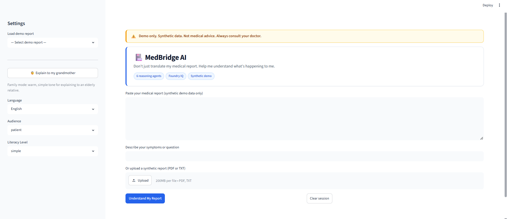

# MedBridge AI

Multilingual Medical Reasoning & Patient Understanding Platform

## Demo UI



Run locally:
```powershell
cd medbridge-ai
.venv\Scripts\Activate.ps1
streamlit run ui/app.py
```

## Hackathon
- Track: Reasoning Agents (Microsoft Foundry)
- Event: Agents League Hackathon 2026
- IQ Integration: Foundry IQ

## ⚠️ Synthetic Data Only
All medical reports and patient data in this repo are **fabricated for demonstration**.
Do not upload real patient information.

## Architecture
See [docs/architecture.md](docs/architecture.md)

## Sample Outputs
See [docs/sample_outputs.md](docs/sample_outputs.md) for agent demo output examples.

## Testing
```powershell
pytest tests/ -v
python scripts/profile_agents.py
```

## Project Structure
```
medbridge-ai/
├── agents/          # 6 reasoning agents
├── orchestrator/    # Multi-agent workflow
├── knowledge/       # Foundry IQ docs
├── data/            # Synthetic reports & knowledge
├── ui/              # Streamlit app
├── tests/           # Test suite
├── scripts/         # Utility scripts
└── docs/            # Architecture docs
```
